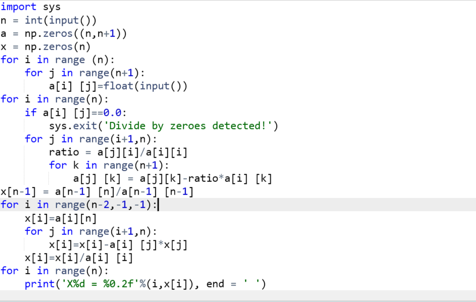
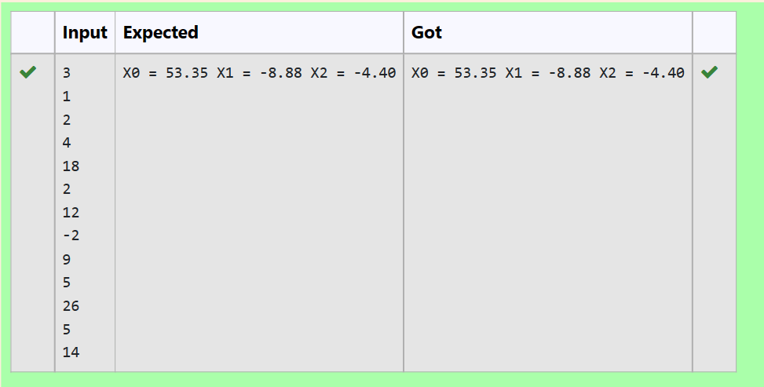

# Gaussian Elimination

## AIM:
To write a program to find the solution of a matrix using Gaussian Elimination.

## Equipments Required:
1. Hardware – PCs
2. Anaconda – Python 3.7 Installation / Moodle-Code Runner

## Algorithm
1. Using numpy and import sys function start the program
2. Take inputs in n,a and x
3. Using nested for loop,write the program for gaussian elimination and print the result using print statement
4. End the program

## Program:
```
/*
Program to solve a matrix using Gaussian elimination with partial pivoting.
Developed by: karna s
RegisterNumber:22008977  
*/
```


## Output:



## Result:
Thus the program to find the solution of a matrix using Gaussian Elimination is written and verified using python programming.

